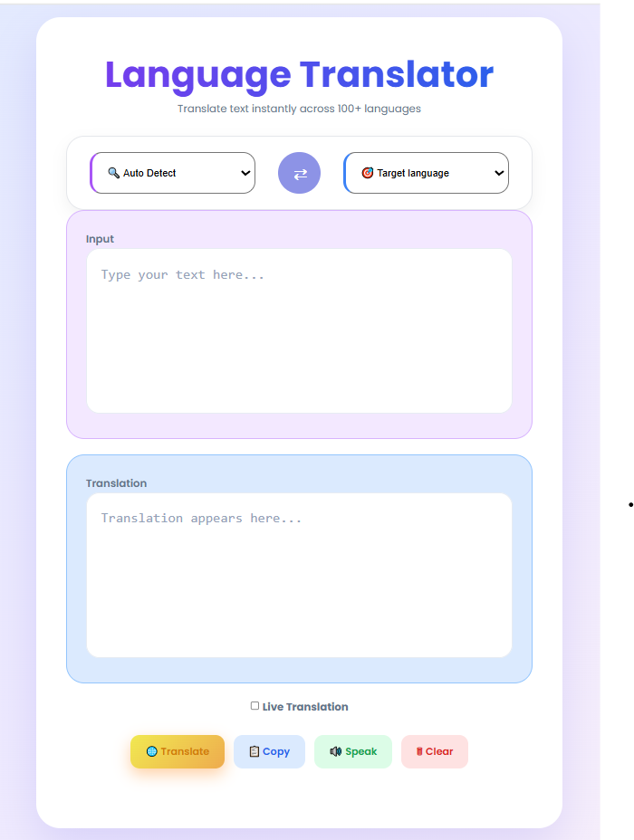
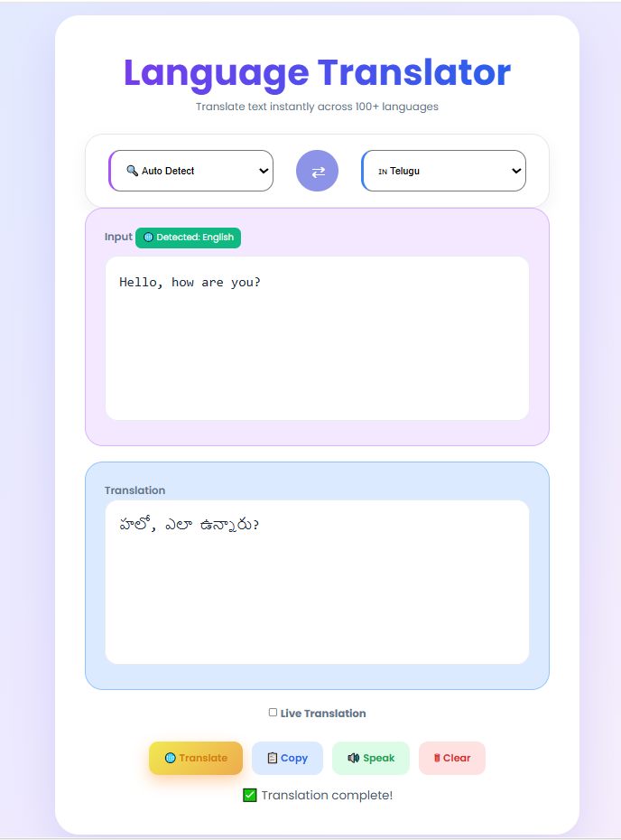
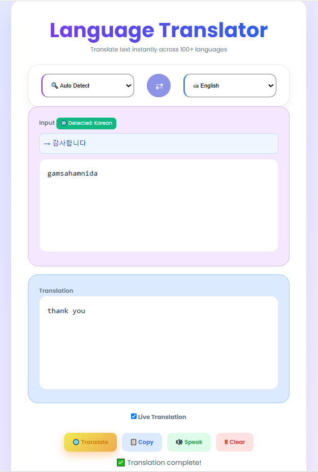
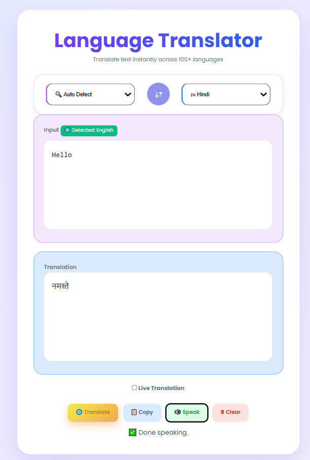

# CodeAlpha Language Translator

A multilingual language translator developed for the CodeAlpha Artificial Intelligence Internship.

## Features

* Auto Language Detection
* Live Translation
* Transliteration Support
* Text-to-Speech
* Copy Translation
* Language Swapping
* Multiple Language Support
* Responsive User Interface

## Technologies Used

* HTML5
* CSS3
* JavaScript
* Google Translate API
* Web Speech API

## How It Works

1. Enter text in the input box.
2. Select source and target languages or use Auto Detect.
3. The application detects the language and transliterates text when required.
4. The text is translated into the selected target language.
5. The translated output is displayed instantly.
6. Users can copy, listen to, clear, or swap translations.
7. Live Translation mode translates text automatically while typing.

## Project Objective

To develop an intelligent language translation tool capable of translating text between multiple languages with features such as language detection, transliteration, speech synthesis, and live translation.

## Internship

CodeAlpha Artificial Intelligence Internship

## 🔗 Live Demo

https://harika-706.github.io/CodeAlpha_LanguageTranslator/

<h2>Screenshots</h2>

<h3>Home Page</h3>

  

<h3>Translation</h3>

  

<h3>Transliteration</h3>

  

<h3>Speech Feature</h3>

  

